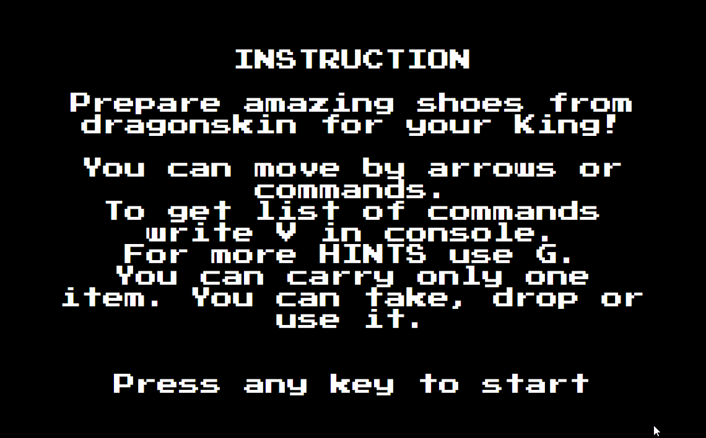

# Dratewka the Shoemaker

Single player RPG for browser (pure JS).

##### Origins

The game was created by Krzysztof Ziembik and Maciej Mendela. Origin version is available [HERE](https://archive.org/details/a8b_Dratewka_the_Shoemaker_2008_Ziembik_Krzysztof_Mendela_Maciej_PL_en_FW). This version is my reconstruction from highschool (2017), refactored in March 2020.

> Dratewka the Shoemaker is a text adventure game, based on the Polish folklore legend of the Dragon of the Wawel Hill. The protagonist of the game is a shoemaker named Dratewka who has to find a way to get rid of the evil dragon, living in the cave at the foot of the Wawel Castle mountain, terrorizing local residents and animals. The player wanders around a town and its surrounding landscape. He may collect items and use them at the appropriate places. Prior to the final meeting with the dragon Dratewka must prepare sulfur stuffed sheep.

## Preview

## Features

-   active compass
-   full story line
-   command recognition
-   items system
-   success screen painted by me
